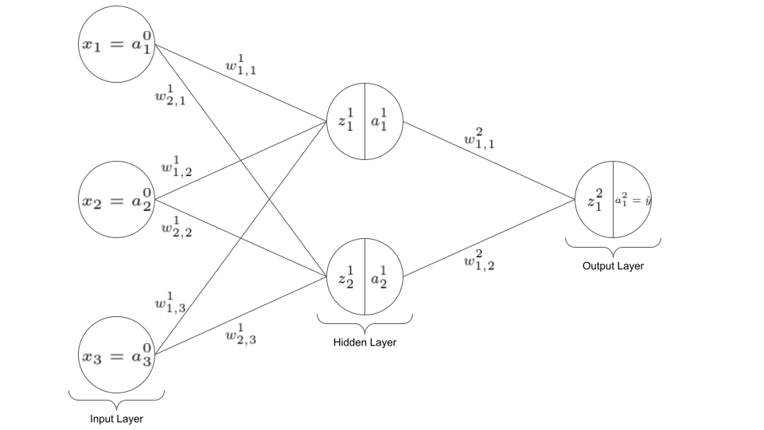

# Neural Networks from Scratch

This repository aims to derive and implement equations for training neural networks from scratch, which consist of an arbitrary number of fully connected, dense layers. First, we will attempt to derive equations for forward- as well as backward propagation in scalar form for a single training example. Then, we will extend these equations to a *matrix-based*  approach for a single training example, and finally, we will extend it to a matrix-based approach for processing `batch_size` examples at once. After implementing the necessary Python code, we will test the network's performance on the MNIST hand-written digits dataset and compare its performance with famous deep learning libraries such as TensorFlow.

# Table of contents

[TOC]

# Forward Propagation

## Forward Propagation in Scalar Form for a Single Training Example

Suppose we wanted to decide whether or not to go to sports today and suppose that we had three types of information, i.e. *input features*, that can aid us making that decision: The weather temperature (in degree Celsius), whether or not we slept well last night (yes or no), and whether or not we have a lot of homework to do (yes or no). To answer the question whether we should go to sports tonight, we might construct a simple neural network consisting of an input layer, one hidden layer and an output layer that might look like this: 

The input layer (layer index 0) consists of 3 neurons, the hidden layer (layer index 1) consists of 2 neurons and the output layer (layer index 2) consists of 1 neuron. The input layer has one neuron per input feature $x_i$ which we will sometimes also refer to as the *activations* of the input layer, so that we may sometimes write $x_i = a_i ^0$ for $i = 1, 2, 3$. This notation allows us to represent the activations in layer $l$ in terms of the activations in layer $l-1$ for all layers $l = 0, 1,..., L$. 

The hidden layer consists of 2 neurons which are supposed to represent more complex, latent (not directly observable) features or combinations of features that the network *learns* by itself so that it can make better decisions whether or not we should go to sports today. For example, if we slept well last night and we have little homework to do, we might be in a very good *mood* today and we want to go to sports. So, some neuron in the hidden layer might be some sort of mood indicator (good or bad). 

Each of these hidden neurons has a *weighted input* $z_i^1$ and a corresponding output, i.e. activation, $a_i^1$ for $i = 1, 2$. For example, 
$$
z_1^1 = a_1^0 w_{1, 1}^1 + a_2^0 w_{1, 2}^1 + a_3^0 w_{1, 3}^1 + b_1^1
$$
$$
a_1^1 = f(z_1^1)
$$

or more generally,
$$
z_i^l = \sum_{k=1}^{n^{l-1}} \left( a_k^{l-1} w_{i, k}^{l} \right) + b_i^l
$$
$$
a_i^l = f(z_i^l)
$$

where $n^{l-1}$ represents the number of neurons in layer $l-1$, $w_{i, k}^l$ represents the weight that connects $a_k^{l-1}$ to $a_i^l$, $b_i^l$ represents a bias term, and where $f(\cdot)$ represents an *activation function* that is applied to the weighted input in order to produce the output, i.e. activation, of neuron $i$ in layer $l$. The weight notation may seem a little cumbersome and counter intuitive at first, but it will make more sense when we introduce the matrix notation of the feed-forward mechanism. Also, for now, we are going to treat $f(\cdot)$ as some non-linear transformation whose output should resemble the *firing* rate of neuron $i$ in layer $l$. We are going to look at a few examples of $f(\cdot)$ and mention some of its desired properties later on, because we need some background knowledge about gradient descent and backpropagation first. 

Finally, in the output layer, we simply have one neuron that represents the probability whether or not we should go to sports, i.e. 
$$
a_1^2 = \hat{y}_i
$$
or more generally,
$$
a_i^L = \hat{y}_i
$$
where $L$ represents the final layer of the network and $\hat{y}_i$ the probability that we go to sports. In this network, there is no benefit for adding the neuron index $i$, but we still left it there to show that the output layer might consists of an arbitrary number of neurons, e.g. one for each category in our classification task. Also, since $\hat{y}$ is a probability, we know that the activation function of the output layer must return values between $0$ and $1$.  

Equation (3) and (4) are the fundamental equations of the forward propagation mechanism, because we can aply (3) and (4) recursively all the way to layer $L$.  

## Forward Propagation in Matrix Form for a Single Training Example

Now, we want to introduce a matrix-based approach for forward propagating the input data to the output data, because first, it will make the notation easier and second, it will make your code run faster when you actually need to implement it in Python. So first, we will rewrite equation (3) as 
$$
\bf{z}^l = \bf{W}^l \bf{a}^{l-1} + \bf{b}^l 
$$
 or written out explicitly with all components
$$
\left[
    \matrix{
    	z_1^l \\
      	z_2^l \\
      	\vdots \\ 
      	z_{n^l}^l
    }
\right] = \left[
	\matrix{
		w_{1, 1}^l & w_{1, 2}^l & \ldots & w_{1, n^{l-1}}^l \\
		w_{2, 1}^l & w_{2, 2}^l & \ldots & w_{2, n^{l-1}}^l \\
		\vdots & \vdots & \ddots & \vdots \\
		w_{n^l, 1}^l & w_{n^l, 2}^l & \ldots & w_{n^l, n^{l-1}}^l 
	}
\right]
\left[ 
	\matrix{
		a_1^{l-^1} \\
		a_2^{l-^1} \\
		\vdots \\
		a_{n^{l-1}}^{l-^1} \\
	}
\right] + 
\left[
	\matrix{
		b_1^{l} \\
		b_2^{l} \\
		\vdots \\
		b_{n^l}^{l} \\
	}
\right]
$$
and then, equation (4) can be rewritten as
$$
\bf{a}^l = f(\bf{z}^l)
$$
where the activation function $f(\cdot)$ is applied element wise
$$
\left[ 
	\matrix{
		a_1^l \\
		a_2^l \\
		\vdots \\
		a_{n^l}^l
	}
\right] = 
\left[
	\matrix{
		f(z_1^l) \\
		f(z_2^l) \\
		\vdots \\
		f(z_{n^l}^l) \\
	}
\right]
$$
So, we just stacked the weighted inputs, the activations and the biases of each layer into column vectors $\bf{z}^l$, $\bf{a}^l$, and $\bf{b}^l$. For each neuron in layer $l$, the weight matrix $W^l$ contains one row and it contains one column for each neuron in layer $l-1$, meaning that the dimensions of $W^l$ are $n^l \times n^{l-1}$. Then finally, in equation (10), the activation function $f(\cdot)$ is just applied to each element of $\bf{z}^l$. 

## Forward Propagation in Matrix Form for a Batch of Training Examples

# Cost Computation

# Backward Propagation

## Gradient Descent

## Backward Propagation in Scalar Form for a Single Training Example

## Backward Propagation in Matrix Form for a Single Training Example

## Backward Propagation in Matrix Form for a Batch of Training Examples

## Weight updates

# Activation functions

Popular choices of activation functions in the hidden layers are the sigmoid (equation 3), ReLU (equation 4) and tanh (equation 5) functions. These functions and their corresponding derivatives are presented below
$$
\sigma(z) = \frac{1}{1 + e^{-z}}
$$

TODO: 

- Show equations for the activation function and their corresponding derivatives
- Show graphs of each activation function and their corresponding derivatives
- Discuss properties of the activation functions in the output layer

Ideally, $f(z)$ should be differentiable, non-linear, monotonically increasing and non-saturating. It should be differentiable, because in the back-propagation algorithm, we need to compute its derivative and it should be non-linear, because otherwise there is no benefit of introducing hidden layers. The latter follows from the fact that a chain of deeply nested linear transformations can be rewritten as merely another linear transformation (CITATION Studienbrief 3). Furthermore, it should be monotonically increasing so that as few as possible local minima are generated (GENERATED WHERE?) and it should be non-saturating to avoid the vanishing gradient problem. The vanishing gradient problem occurs when the norm of the gradient[^2] is very small which happens when $z$ is very large and $f'(z)$ is very small. Of course, the monotonically increasing and non-saturating properties could easily be achieved by setting $f(z)$ to the identity function, but then $f(z)$ would not be non-linear anymore, so there are some tradeoffs to be made and in practice, the ReLU is a good compromise between these tradeoffs. Note however, that the ReLU function is actually not defined at $z = 0$ so theoretically, it is not always differentiable. In practice however, the probability that $z$ is *exactly* $0$ is extremely small so that in code, it is often implemented that $f'(0) = 0$. 

In the output layer, the activation may also be linear and it depends whether we're doing regression or classification (multi-class or multi-label)...

[^2]: The gradient of the cost function with respect to all the weights and biases in the network
