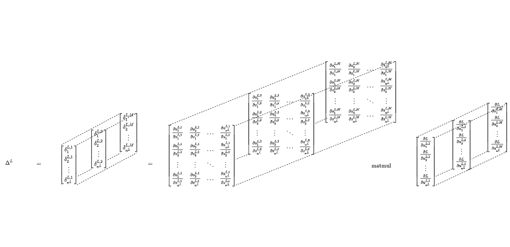

# Neural Networks from Scratch

This document aims to derive and implement equations for training Multi Layer Perceptrons (MLPs), i.e. neural networks consisting of fully connected, dense layers, from scratch. These neural networks will consist of an arbitrary number of layers, each with an arbitrary number of neurons and arbitrary choice of activation function. First, we will derive equations for the forward- as well as backward propagation algorithms in scalar form for a single training example. Then, we will extend these equations to a *matrix-based*  approach for a single training example, and finally, we will extend them to a matrix-based approach for a batch of training examples.  

# Table of contents

[TOC]

# Forward Propagation

The forward propagation algorithm propagates inputs through the layers of the network until they reach the output layer which generates the predictions. After that, the quality of these predictions are evaluated by calculating a certain cost function.    

## Forward Propagation for a Single Training Example

Suppose we wanted to decide whether or not to go to sports today and suppose that we had three types of information, i.e. *input features*, that can aid us making that decision: The weather temperature (in degree Celsius), whether or not we slept well last night (yes or no), and whether or not we have a lot of homework to do (yes or no). To answer the question whether we should go to sports tonight, we might construct a simple neural network consisting of an input layer, one hidden layer and an output layer that might look like this: 

Figure 1: Example neural network

The input layer (layer index 0) consists of 3 neurons, the hidden layer (layer index 1) consists of 2 neurons and the output layer (layer index 2) consists of 1 neuron. The input layer has one neuron per input feature $x_i$ which we will sometimes also refer to as the *activations* of the input layer, so that we may sometimes write $x_i = a_i ^0$ for $i = 1, 2, 3$. Later on,  this notation will allow us to represent the activations in layer $l$ in terms of the activations in layer $l-1$ for all layers $l = 0, 1,..., L$. 

The hidden layer consists of 2 neurons which are supposed to represent more complex, latent (not directly observable) features or combinations of features that the network *learns* by itself so that it can make better decisions whether or not we should go to sports today. For example, if we slept well last night and we have little homework to do, we might be in a very good *mood* today and we want to go to sports. So, some neuron in the hidden layer might be some sort of mood indicator (good or bad). 

Each of these hidden neurons has a *dendritic potential* $z_i^1$ and a corresponding *firing rate*, i.e. activation, $a_i^1$ for $i = 1, 2$. For example, 
$$
z_1^1 = a_1^0 w_{1, 1}^1 + a_2^0 w_{1, 2}^1 + a_3^0 w_{1, 3}^1 + b_1^1
$$
$$
a_1^1 = f(z_1^1, z^1_2, z^1_3)
$$

or more generally,
$$
z_i^l = \sum_{k=1}^{n^{l-1}} \left( a_k^{l-1} w_{i, k}^{l} \right) + b_i^l
$$
$$
a_i^l = f(z^l_1, z^l_2, ..., z_i^l, ..., z^l_{n^{l-1}}),
$$

where $n^{l-1}$ represents the number of neurons in layer $l-1$, $w_{i, k}^l$ the weight that connects $a_k^{l-1}$ to $a_i^l$, $b_i^l$ represents a bias term, and where $f(\cdot)$ represents an *activation function* that is applied to the weighted input in order to produce the activation $a_i^l$ of neuron $i$ in layer $l$. 

The weights and biases are initialized with random values and represent the parameters of the network, i.e. the parameters which the network *learns* and updates during the training phase. The activation function $f(\cdot)$ is some non-linear transformation transforming the dendritic potential into the firing rate of neuron $i$ in layer $l$. The activation function may or may not depend on a single dendritic potential, but to keep the discussion simple for now, we will assume that our activation function is the sigmoid function which only depends on a single input and is defined as
$$
f(z_i^l) = \frac{1}{1 + e^{-z_i^l}},
$$
which has the desirable property that $0 < f(z_i^l) < 1$, so we can say that neuron $a_i^l$ is firing if $f(z_i^l)$ is close to 1. 

Then, in the output layer of our example network, we simply have one neuron that represents the probability whether or not we should go to sports, i.e. 
$$
a_1^2 = \hat{y}_i
$$
or more generally,
$$
a_i^L = \hat{y}_i
$$
where $L$ represents the final layer of the network and $\hat{y}_i$ the *probability* that we go to sports. In our example network, there is no benefit for adding the neuron index $i$, but we still left it there to show that the output layer might consists of an arbitrary number of neurons, e.g. one for each category in our classification task. Also, since $\hat{y}_i$ is a probability, we know that the activation function of the output layer must return values between $0$ and $1$. To convert the predicted probability that we will go to sports into an actual decision, we will apply a threshold as follows
$$
\text{prediction}_i =
\begin{cases}
1, & \hat{y}_i > \text{threshold}_i \\
0, & \hat{y}_i \leq \text{threshold}_i
\end{cases},
$$
where $1$ means that we will go to sports and $0$ that we won't go to sports. The threshold for category $i$ may be chosen manually and fine tuned on a validation set, but for now, we will assume that $\text{threshold} = 0.5$. If you decide to increase the threshold, your model is likely to achieve a higher precision at the expense of recall and if you decide to decrease the threshold, your model is likely to achieve a higher recall at the expense of precision. Precision is the ratio of true positives divided by the sum of true positives and false positives while recall is the ratio of true positives divided by the sum of true positives and false negatives. 

Now, we want to introduce a matrix-based approach for forward propagating the input data to the output layer, because first, it will make the notation easier and second, it will make your code run faster when you actually need to implement it in Python, because vectorized operations are highly efficient and optimized. So first, we will rewrite equation (3) as 
$$
\textbf{z}^l = \textbf{W}^l \textbf{a}^{l-1} + \textbf{b}^l
$$
 or written out explicitly with all components
$$
\left[
    \matrix{
    	z_1^l \\
      	z_2^l \\
      	\vdots \\ 
      	z_{n^l}^l
    }
\right] = \left[
	\matrix{
		w_{1, 1}^l & w_{1, 2}^l & \ldots & w_{1, n^{l-1}}^l \\
		w_{2, 1}^l & w_{2, 2}^l & \ldots & w_{2, n^{l-1}}^l \\
		\vdots & \vdots & \ddots & \vdots \\
		w_{n^l, 1}^l & w_{n^l, 2}^l & \ldots & w_{n^l, n^{l-1}}^l 
	}
\right]
\left[ 
	\matrix{
		a_1^{l-^1} \\
		a_2^{l-^1} \\
		\vdots \\
		a_{n^{l-1}}^{l-^1} \\
	}
\right] + 
\left[
	\matrix{
		b_1^{l} \\
		b_2^{l} \\
		\vdots \\
		b_{n^l}^{l} \\
	}
\right]
$$
and then, equation (4) can be rewritten as
$$
\textbf{a}^l = f(\textbf{z}^l),
$$
where, in case of the sigmoid function, the activation function $f(\cdot)$ is applied element wise such as
$$
\left[ 
	\matrix{
		a_1^l \\
		a_2^l \\
		\vdots \\
		a_{n^l}^l
	}
\right] = 
\left[
	\matrix{
		f(z_1^l) \\
		f(z_2^l) \\
		\vdots \\
		f(z_{n^l}^l) \\
	}
\right].
$$
So, we just stacked the weighted inputs, the activations and the biases of each layer into column vectors $\textbf{z}^l$, $\textbf{a}^{l-1}$, and $\textbf{b}^l$. For each neuron in layer $l$, the weight matrix $\textbf{W}^l$ contains one row and for each neuron in layer $l-1$, it contains one column, meaning that the dimensions of $\textbf{W}^l$ are $n^l \times n^{l-1}$. Then finally, the sigmoid activation function $f(\cdot)$ is just applied to each element of $\textbf{z}^l$ to produce the activation vector $\textbf{a}^l$. 

We can now apply equations (9) and (11) recursively all the way to the output layer $L$, until we compute the predicted probabilities of the network as follows
$$
\textbf{a}^L = \hat{\textbf{y}},
$$
or written out explicitly
$$
\left[ 
	\matrix{
		a_1^L \\
		a_2^L \\
		\vdots \\
		a_{n^L}^L
	}
\right] = 
\left[ 
	\matrix{
		\hat{y}_1 \\
		\hat{y}_2 \\
		\vdots \\
		\hat{y}_{n^L}
	}
\right],
$$
where each $\hat{y}_i$ is converted into an actual decision using (8). 

Having computed $\textbf{a}^L$​, we can compute a certain *loss* which indicates how well or badly our model predicts for a *single* training example. For a classification problems where *exactly* one of  $n^L$​ classes must be predicted (i.e. a Multi-Class classification problem), a commonly used loss function is the *categorical cross entropy*, which is defined as follows

$$
L(\textbf{y}, \hat{\textbf{y}}) 
= -|| \textbf{y} \ log(\hat{\textbf{y}}) ||^2 
= -\sum_{i=1}^{n^L} y_i \ log(\hat{y}_i),
$$
where $\textbf{y}$ is the ground truth vector (containing the target values) where element $y_i = 1$ and all other elements are zero if the current training example belongs to class $i$. We may also say that $\textbf{y}$ is *one-hot-encoded*. 

In general, we want a loss function which has high values for bad predictions, i.e. when $\hat{y}_i$​​ is far away from $y_i$​​, and low values for good predictions, i.e. when $\hat{y}_i$​​ is very close to $y_i$​​. Let's see if component $i$​​ of (15) fulfills these requirements by considering the following example of a multi-class classificaton problem with 2 classes:

- Bad predictions

  - If $\textbf{y} = [1, 0]^T$ and $\hat{\textbf{y}} = [0, 1]^T$, then $L(y_i, \hat{y}_i)= -(1 \times log(0) + 0 \times log(1)) = -(-\infty + 0) = \infty$
  - If $\textbf{y} = [0, 1]^T$ and $\hat{\textbf{y}} = [1, 0]^T$, then $L(y_i, \hat{y}_i)= -(0 \times log(1) + 1 \times log(0)) = -(0 -\infty) = \infty$

- Good predictions

  - If $\textbf{y} = [1, 1]^T$ and $\hat{\textbf{y}} = [1, 1]^T$, then $L(y_i, \hat{y}_i)= -(1 \times log(1) + 1 \times log(1)) = -(0 + 0) = 0$
  - If $\textbf{y} = [0, 0]^T$ and $\hat{\textbf{y}} = [0, 0]^T$, then $L(y_i, \hat{y}_i)= -(0 \times log(0) + 0 \times log(0)) = -(0 + 0) = 0$

in all of the 4 above cases, we get the desired result. 

## Forward Propagation for a Batch of  Training Examples

Assuming that we have $M$ training examples in our current batch and $n^0$ input features, imagine a 3 dimensional (3D) matrix $\textbf{X} = \textbf{A}^0$, of dimensions $(M \times n^0 \times 1)$, where each element in the depth dimension belongs to a different training example: 

Figure 2

Next, equation (9) becomes
$$
\textbf{Z}^l = \textbf{W}^l \textbf{A}^{l-1} + \textbf{B}^l,
$$
or written out explicitly

Figure 4

where the weight matrix $\textbf{W}^l$ and the bias vector $\textbf{B}^l$ have been broad-casted $M$ times in order to make the whole operation compatible. The dimensions of each component are as follows

- $\textbf{Z}^l: M \times n^l \times 1$
- $\textbf{W}^l: M \times n^l \times n^{l-1}$
- $\textbf{A}^{l-1}: M \times n^{l-1} \times 1$
- $\textbf{W}^l \textbf{A}^{l-1}: M \times n^{l} \times 1$. Note here, that each of the $M$ matrix multiplications is done independently and in parallel
- $\textbf{B}^l: M \times n^{l} \times 1$

so the dimensions are conform. Also note that we chose to represent the depth dimension as the first dimension (`axis=0`), because that is how `numpy` arranges matrix multiplications of $ND$ arrays where $N>2$, and because it is easier to draw that way. 

Then, like before, the activation function is applied independently to each training example
$$
\textbf{A}^l = f(\textbf{Z}^l),
$$
which, in case of the sigmoid function is equal to

Figure 5

Like before, equations (19) and (21) are applied recursively to layer $L$, until we can compute all `batch_size` losses at once, yielding the following result

Figure 6

where each element of the above 3D loss array represents the loss we have already defined in equation (15), i.e.
$$
L(\textbf{y}^m, \hat{\textbf{y}}^m) = -\sum_{i=1}^{n^L} y_i^m log(\hat{y}_i^m).
$$

Having computed the loss array $L(\textbf{Y}, \hat{\textbf{Y}})$, we can now aggregate over all $M$ training examples to compute a certain *cost*, which is just the average over all training examples in the current batch
$$
C = \frac{1}{M} \sum_{m=1}^M L(\textbf{y}^m, \hat{\textbf{y}}^m) 
= -\frac{1}{M} \sum_{m=1}^M \sum_{i=1}^{n^L} y_i^m log(\hat{y}_i^m),
$$
Note that the loss function represents an error over a *single* training example, while the cost function is an aggregation of the loss over $M$ training examples. When computing the cost for $M$ training examples, it makes sense to choose the average as an aggregation method, because the average cost doesn't increase linearly with the `batch_size`. Also, the cost function may include a regularization term, which should be monotonically increasing in the number of parameters of the model, to account for over-fitting.

# Backward Propagation

Neural networks learn by iteratively adjusting their weights and biases such that the cost decreases, i.e. such that the predictions become more accurate. This goal is achieved by (1) computing all partial derivatives of the cost w.r.t. the weights and biases in the network (the *gradient*) and (2) by updating the weights and biases using *gradient descent*. This section will describe how to calculate (1), the gradient using the backpropagation algorithm which is a very cost efficient algorithm. First, the backpropagation algorithm is explained for a single training example and then extended to a whole batch of training examples. 

The backpropagation algorithm generally works as follows. For any given layer $l$​​​, the backpropagation algorithm computes an intermediate quantity, the so called *error*​​​ at layer $l$, and then computes the gradients of the weights and biases in layer $l$ using that error. Then, the error is propagated one layer backwards and the gradients are computed again. This process is repeated recursively until the gradients of the weights and biases in layer 1 (layer with index 1) are computed. 

The backpropagation algorithm is based on 4 key equations which we will derive in detail in the following sections. The four key equations are as follows:

- BP1.x: An equation for the error at the output layer, needed for initializing the backpropagation algorithm
  - When considering a single training example, we will refer to this equation as $\boldsymbol{\delta}^L$ or BP1.1
  - When considering `batch_size`training examples, we will refer to this equation as $\boldsymbol{\Delta}^L$​ or BP1.2​, which is a matrix where each column contains the error for a different training example.
- BP2.x: A recursive equation relating the error at layer $l+1$​​​ to the error at layer $l$​​​​​​​​, needed for recursively calculating the error at each layer.
  - When considering a single training example, we will refer to this equation as $\boldsymbol{\delta}^l$ or BP2.1
  - When considering `batch_size` training examples, we will refer to this equation as $\boldsymbol{\Delta}^l$​ or BP2.2, which again, is a matrix where each column contains the error for a different training example.
  - Note that in the first iteration, we must set $\boldsymbol{\delta}^l = \boldsymbol{\delta}^L$​​ or $\boldsymbol{\Delta}^l = \boldsymbol{\Delta}^L$ which we already computed in BP1.1 and BP1.2 respectively. ​​After that, we can recursively substitute the error all the way back to the input layer. 
- BP3.x: An equation relating the error at layer $l$ to:
  - The derivative of the *loss* function w.r.t the weights in layer $l$​ when considering a *single* training example, i.e. $\frac{\partial L}{\partial \textbf{W}^l}$​. We'll refer to this equation as BP3.1
  - The derivative of the *cost* function w.r.t. the weights in layer $l$​ when considering a *batch* of training examples, i.e. $\frac{\partial C}{\partial \textbf{W}^l}$​​.We'll refer to this equation as BP3.2
- BP4.x: An equation relating the error at layer $l$ to:
  - The derivative of the *loss* function w.r.t the biases in layer $l$​​​ when considering a *single* training example, i.e. $\frac{\partial L}{\partial \textbf{b}^l}$​​​. We'll refer to this equation as BP4.1
  - The derivative of the *cost* function w.r.t. the biases in layer $l$​​​​ when considering a *batch* of training examples, i.e. $\frac{\partial C}{\partial \textbf{b}^l}$​​​​​​.We'll refer to this equation as BP4.2

Most of the work will go into deriving equations BP1.1-BP4.1 and applying these equations to `batch_size` training examples at once is just a little overhead in math but will save a lot of time when running the actual code.  

## Why Backpropagation

You might wonder why we should bother trying to derive a complicated algorithm and not use other seemingly simpler methods for computing all partial derivatives in the network. To motivate the need for the backpropagation algorithm, assume we simply wanted to compute the partial derivative of weight $w_{j}$ as follows[^2]
$$
\frac{\partial L}{\partial w_{j}} = \frac{L(\textbf{w} + \epsilon \textbf{e}_{j}, \textbf{b}) - L(\textbf{w}, \textbf{b})}{\epsilon},
$$
where $\textbf{w}$​​ and $\textbf{b}$​​ are flattened vectors containing all weights and biases of the network, where $\epsilon$​​ is a infinitesimal scalar and where $\textbf{e}_j$​​ is the unit vector being $1$​​ at position $j$​​ and $0$​​ elsewhere. Assuming that our network has one million parameters, we would need to calculate $L(\textbf{w} + \epsilon \textbf{e}_j, \textbf{b})$​ a million times (once for each $j$​), and also, we would need to calculate $L(\textbf{w}, \textbf{b})$​ once, summing up to a total of $1,000,001$​ forward passes for just a *single* training example! As we will see in this section, the backpropagation algorithm let's us compute all partial derivatives of the network with just one forward- and one backward pass through the network, so the backpropagation algorithm is a very efficient way of computing the gradients.

[^2]: For simplicity reasons we left out the layer and column indices of the weight matrices, because this has no influence on the point we want to make. 

## Backpropagation for a Single Training Example

### BP1.1

In order to conveniently represent the error at any layer $l$, will introduce the following notation
$$
(\boldsymbol{\delta}^l)^T \coloneqq \frac{\partial L}{\partial \textbf{z}^l}.
$$
Notice that the transposition $T$ must be used, because the derivative of a scalar ($L$) w.r.t a vector ($\textbf{z}^l$) is defined as a row vector[^1].

[^1]: Notice that some authors define the derivative of a scalar w.r.t. a vector as a column vector. No matter which notation is used, the results of one notation should be equal to the transposition of the other notation. 

The error at the output layer can be expressed as follows (remembering the chain rule from calculus)
$$
(\boldsymbol{\delta}^L)^T 
\coloneqq \frac{\partial L}{\partial \textbf{z}^L} 
= \frac{\partial L}{\partial \textbf{a}^L} \frac{\partial \textbf{a}^L}{\partial \textbf{z}^L}
= \nabla L(\textbf{a}^L) \ \textbf{J}_{\textbf{a}^L}(\textbf{z}^L).
$$

The above equation shows us that the error at the output layer can be decomposed into the *gradient* $\nabla L(\textbf{a}^L)$, and the *Jacobi* matrix $\textbf{J}_{\textbf{a}^L}(\textbf{z}^L)$, from which the latter represents the derivative of a vector w.r.t. another vector. So, writing out every component of the above expression produces
$$
\nabla L(\textbf{a}^L) \ \textbf{J}_{\textbf{a}^L}(\textbf{z}^L) = 
\left[
	\matrix{
    \frac{\partial L}{\partial a^L_1} & \frac{\partial L}{\partial a^L_2} & ... & \frac{\partial L}{\partial a^L_{n^L}}
    }
\right]
\left[
	\matrix{
    	\frac{\partial a^L_1}{\partial z^L_1} & \frac{\partial a^L_1}{\partial z^L_2} & ... & \frac{\partial a^L_1}{\partial z^L_{n^L}} \\
        \frac{\partial a^L_2}{\partial z^L_1} & \frac{\partial a^L_2}{\partial z^L_2} & ... & \frac{\partial a^L_2}{\partial z^L_{n^L}} \\
        \vdots & \vdots & \ddots & \vdots \\
        \frac{\partial a^L_{n^L}}{\partial z^L_1} & \frac{\partial a^L_{n^L}}{\partial z^L_2} & ... & \frac{\partial a^L_{n^L}}{\partial z^L_{n^L}}
    }
\right],
$$
which ends up as a $1 \times n^L$ row vector. In its most general form, the above vector matrix product represents **BP1.1**, so without making any assumptions about the loss function $L$​​ and the activation function in the output layer $a^L$​​, the above equation cannot be simplified any further. In the next section, we will show how to further specify this equation by choosing a specific loss and activation function. 

#### Example

For multi-class classification problems, a common choice for the loss function is the categorical cross entropy (see equation 15) and a common choice for the activation function in the output layer is the *softmax* function, which unlike e.g. the sigmoid activation function, takes a vector as input and also outputs a vector, whose $j$​-th component is defined as follows 
$$
a^l_j = \textbf{f}([z^l_1, z^l_2, ..., z^l_j, ..., z^l_{n^l}])_j = \frac{e^{z^l_j}}{\sum_{k=1}^{n^l} e^{z^l_k}}.
$$
First, we will try to find concrete expressions for each component of $\nabla L(\textbf{a}^L)$ in (27). From the categorical cross entropy loss function in equation 15, we can derive that for $i = 1, 2, ..., n^L$,
$$
\frac{\partial L}{\partial a^{L}_j} = - \frac{y_j}{a^{L}_j},
$$

where we used the fact that $\hat{y}_j = a^{L}_j$​​​​​​​. 

Second, we want to find concrete expressions for each component of $\textbf{J}_{\textbf{a}^L}(\textbf{z}^L)$​​​​ in (27). When taking the derivative of the Softmax function, we need to consider two cases. The first case is represented by $\frac{\partial a^L_j}{\partial z^L_k}$​​​​, if $j=k$​​​​, i.e. $\frac{\partial a^L_j}{\partial z^L_j}$​​​​.
$$
\large
\begin{array}{l}
	\frac{\partial a^L_j}{\partial z^L_j} 
	& = \frac{e^{z^L_j} \left( \sum^{n^L}_{k=1} e^{z^l_k} \right) - e^{z^L_j} e^{z^L_j}}{\left( \sum^{n^L}_{k=1} e^{z^L_k} \right)^2} \\
	& = \frac{e^{z^L_j} \left( \left(\sum^{n^L}_{k=1} e^{z^L_k} \right) - e^{z^L_j} \right)}{\left( \sum^{n^L}_{k=1} e^{z^L_k} \right)^2} \\
	& = \frac{e^{z^L_j}}{\sum^{n^L}_{k=1} e^{z^L_k}} \frac{\left( \sum^{n^L}_{k=1} e^{z^L_k} \right) - e^{z^L_j}}{\sum^{n^L}_{k=1} e^{z^L_k}} \\
	& = \frac{e^{z^L_j}}{\sum^{n^L}_{k=1} e^{z^L_k}} \left( \frac{\sum^{n^L}_{k=1} e^{z^L_k}}{\sum^{n^L}_{k=1} e^{z^L_k}} - \frac{e^{z^L_k}}{\sum^{n^L}_{k=1} e^{z^L_k}} \right) \\ 
	& = \frac{e^{z^L_j}}{\sum^{n^L}_{k=1} e^{z^L_k}} \left( 1 - \frac{e^{z^L_k}}{\sum^{n^L}_{k=1} e^{z^L_k}} \right),
\end{array}
$$
 where we can now use the definition of the Softmax function (equation 28) again to simplify further to
$$
\frac{\partial a^L_j}{\partial z^L_j} = a^L_j (1 - a^L_j).
$$
The second case is represented by $\frac{\partial a^L_j}{\partial z^L_k}$​​, where $k \neq j$​​, so that
$$
\large
\begin{array}{l}
	\frac{\partial a^L_j}{\partial z^L_k}
	& = \frac{0 \times \left(\sum^{n^L}_{k=1} e^{z^L_k} \right) - e^{z^L_j} e^{z^L_k}}{\left( \sum^{n^L}_{k=1} e^{z^L_k} \right)^2} \\
	& = \frac{- e^{z^L_j} e^{z^L_k}}{\left( \sum^{n^L}_{k=1} e^{z^L_k} \right)^2} \\
	& = - \frac{e^{z^L_j}}{\left( \sum^{n^L}_{k=1} e^{z^L_k} \right)} \frac{e^{z^L_k}}{\left( \sum^{n^L}_{k=1} e^{z^L_k} \right)} \\
	& = -a^L_j \ a^L_k.
\end{array}
$$
So, summarizing, 
$$
\frac{\partial a^L_j}{\partial z^L_k} = 
	\begin{cases}
		a^L_j(1-a^L_j) & \text{if} & j=k \\
        -a^L_j \ a^L_k & \text{if} & j \neq k
	\end{cases}
$$

Using (29) and (33), we can now fill in each component of (27) as follows
$$
\nabla L(\textbf{a}^L) \ \textbf{J}_{\textbf{a}^L}(\textbf{z}^L) = 
- \left[
	\matrix{
    	\frac{y_1}{a^L_1} & \frac{y_2}{a^L_2} & ... & \frac{y_{n^L}}{a^L_{n^L}}
    }
\right]
\left[
	\matrix{
    	a^L_1 (1 - a^L_1), & -a^L_1 \ a^L_2 & ... & -a^L_1 \ a^L_{n^L} \\
        -a^L_2 \ a^L_1, & a^L_2 (1 - a^L_2) & ... & -a^L_2 \ a^L_{n^L} \\
        \vdots & \vdots & \ddots & \vdots \\
        -a^L_{n^L} \ a^L_1, & -a^L_{n^L} \ a^L_2 & ... & a^L_{n^L} (1 - a^L_{n^L})
    }
\right],
$$

which, when multiplied out, yields
$$
\nabla L(\textbf{a}^L) \ \textbf{J}_{\textbf{a}^L}(\textbf{z}^L) = 
\left[
	\matrix{
		-y_1 + a^L_1(y_1 + y_2 + ... + y_{n^L})
		& -y_2 + a^L_2(y_1 + y_2 + ... + y_{n^L})
		& ...
		& -y_{n^L} + a^L_{n^L}(y_1 + y_2 + ... + y_{n^L}) 
	}
\right].
$$
Notice that $(y_1 + y_2 + ... + y_{n^L}) = 1$ due to the one hot encoded target vector $\textbf{y}$. So, we can simplify the above expression to
$$
\nabla L(\textbf{a}^L) \ \textbf{J}_{\textbf{a}^L}(\textbf{z}^L) = 
- \left[
	\matrix{
		(y_1 - a^L_1) & (y_2 - a^L_2) & ... & (y_{n^L} - a^L_{n^L})
	}
\right].
$$

### BP2.1

In order to represent the error of the previous layer $(\boldsymbol{\delta}^{l-1})^T$​ in terms of the error in the current layer $(\boldsymbol{\delta}^{l})^T$, it helps to view the loss function as a nested functions of weighted input vectors, i.e. $L(\textbf{z}^l(\textbf{z}^{l-1}))$ which we want to derive w.r.t. $\textbf{z}^{l-1}$. This can be done as follows
$$
(\boldsymbol{\delta}^{l-1})^T
\coloneqq \frac{\partial L}{\partial \textbf{z}^{l-1}}
= \frac{\partial L}{\partial \textbf{z}^l} \frac{\partial \textbf{z}^l}{\partial \textbf{z}^{l-1}}
= \nabla L(\textbf{z}^l) \ \textbf{J}_{\textbf{z}^l}(\textbf{z}^{l-1}) ,
$$
which can be written out explicitly as
$$
\nabla L(\textbf{z}^l) \ \textbf{J}_{\textbf{z}^l}(\textbf{z}^{l-1}) 
= \left[
	\matrix{
		\frac{\partial L}{\partial z^l_1} & \frac{\partial L}{\partial z^l_2} & ... & \frac{\partial L}{\partial z^l_{n^l}} 
	}
\right]
\left[
	\matrix{
		\frac{\partial z^l_1}{\partial z^{l-1}_1} & \frac{\partial z^l_1}{\partial z^{l-1}_2} & ... & \frac{\partial z^l_1}{\partial z^{l-1}_{n^{l-1}}} \\
        \frac{\partial z^l_2}{\partial z^{l-1}_1} & \frac{\partial z^l_2}{\partial z^{l-1}_2} & ... & \frac{\partial z^l_2}{\partial z^{l-1}_{n^{l-1}}} \\
        \vdots & \vdots & \ddots & \vdots \\
        \frac{\partial z^l_{n^l}}{\partial z^{l-1}_1} & \frac{\partial z^l_{n^l}}{\partial z^{l-1}_2} & ... & \frac{\partial z^l_{n^l}}{\partial z^{l-1}_{n^{l-1}}}
	}
\right].
$$
In order to find an expression for every component of $\nabla L(\textbf{z}^l)$, notice that by our definition in equation (25), 
$$
\frac{\partial L}{\partial z^l_j} = \delta^l_j.
$$
In order to find an expression for every component of $\textbf{J}_{\textbf{z}^l}(\textbf{z}^{l-1})$, recall that $z^l_j = \sum^{n^{l-1}}_{k=1} \left( a^{l-1}_k w^l_{j, k} \right) + b^l_j$ and therefore, 
$$
\frac{\partial z^l_j}{\partial z^{l-1}_k} = \sum^{n^{l-1}}_{i=1} w^l_{j, i} \frac{\partial a^{l-1}_i}{\partial z^{l-1}_k},
$$
where we need to use the total differential. To add a little more intuition why the total differential must be used here, consider the following picture and assume that we wanted to determine $\frac{\partial z^l_1}{\partial z^{l-1}_2}$. 

Figure 7 

When determining $\frac{\partial z^l_1}{\partial z^{l-1}_2}$, we want to figure out how much $z^l_1$ changes if $z^{l-1}_2$ (that's how derivatives are defined). In order for $z^l_1$ to change, there are 2 sorts of ways how to achieve that:

1. A change in $z^{l-1}_2$ leads to a change $a^{l-1}_2$, which is amplified by $w^l_{1, 2}$.
2. A change in $z^{l-1}_2$ might cause a change in $a^{l-1}_i \ \text{for} \ i = 1, 3$, if e.g. the softmax activation function is used, and each change in $a^{l-1}_i \ \text{for} \ i = 1, 3$ is amplified by $w^l_{1, 1}$ and $w^l_{1, 3}$ respectively.  

Using (39) and (40), we can fill in each component of (38) as follows
$$
\nabla L(\textbf{z}^l) \ \textbf{J}_{\textbf{z}^l}(\textbf{z}^{l-1}) 
= \left[
	\matrix{
		 \delta^l_1 & \delta^l_2 & ... & \delta^l_{n^l}
	}
\right]
\left[
	\matrix{
		\sum^{n^{l-1}}_{i=1} w^l_{1, i} \frac{\partial a^{l-1}_i}{\partial z^{l-1}_1}
		& \sum^{n^{l-1}}_{i=1}  w^l_{1, i} \frac{\partial a^{l-1}_i}{\partial z^{l-1}_2}
		& ...
		& \sum^{n^{l-1}}_{i=1}  w^l_{1, i} \frac{\partial a^{l-1}_i}{\partial z^{l-1}_{n^{l-1}}} \\
		
		\sum^{n^{l-1}}_{i=1} w^l_{2, i} \frac{\partial a^{l-1}_i}{\partial z^{l-1}_1}
		& \sum^{n^{l-1}}_{i=1}  w^l_{2, i} \frac{\partial a^{l-1}_i}{\partial z^{l-1}_2}
		& ...
		& \sum^{n^{l-1}}_{i=1}  w^l_{2, i} \frac{\partial a^{l-1}_i}{\partial z^{l-1}_{n^{l-1}}} \\
		
		\vdots & \vdots & \ddots & \vdots \\
		
		\sum^{n^{l-1}}_{i=1} w^l_{n^l, i} \frac{\partial a^{l-1}_i}{\partial z^{l-1}_1}
		& \sum^{n^{l-1}}_{i=1}  w^l_{n^l, i} \frac{\partial a^{l-1}_i}{\partial z^{l-1}_2}
		& ...
		& \sum^{n^{l-1}}_{i=1}  w^l_{n^l, i} \frac{\partial a^{l-1}_i}{\partial z^{l-1}_{n^{l-1}}} \\
	}
\right],
$$
which can be decomposed into
$$
\nabla L(\textbf{z}^l) \ \textbf{J}_{\textbf{z}^l}(\textbf{z}^{l-1}) 
= \left[
	\matrix{
		 \delta^l_1 & \delta^l_2 & ... & \delta^l_{n^l}
	}
\right]
\left[
	\matrix{
		w^l_{1, 1} & w^l_{1, 2} & ... & w^l_{1, n^{l-1}} \\
		w^l_{2, 1} & w^l_{2, 2} & ... & w^l_{2, n^{l-1}} \\
		\vdots & \vdots & \ddots & \vdots \\
		w^l_{n^l, 1} & w^l_{n^l, 2} & ... & w^l_{n^l, n^{l-1}}
	}
\right]
\left[
	\matrix{
		\frac{\partial a^{l-1}_1}{\partial z^{l-1}_1} & \frac{\partial a^{l-1}_1}{\partial z^{l-1}_2} & ... & \frac{\partial a^{l-1}_1}{\partial z^{l-1}_{n^{l-1}}} \\
		\frac{\partial a^{l-1}_2}{\partial z^{l-1}_1} & \frac{\partial a^{l-1}_2}{\partial z^{l-1}_2} & ... & \frac{\partial a^{l-1}_2}{\partial z^{l-1}_{n^{l-1}}} \\
		\vdots & \vdots & \ddots & \vdots \\
		\frac{\partial a^{l-1}_{n^{l-1}}}{\partial z^{l-1}_1} & \frac{\partial a^{l-1}_{n^{l-1}}}{\partial z^{l-1}_2} & ... & \frac{\partial a^{l-1}_{n^{l-1}}}{\partial z^{l-1}_{n^{l-1}}}
	}
\right],
$$
or in short,
$$
(\boldsymbol{\delta}^{l-1})^T 
= \nabla L(\textbf{z}^l) \ \textbf{J}_{\textbf{z}^l}(\textbf{z}^{l-1})
= (\boldsymbol{\delta}^l)^T \ \textbf{W}^l \ \textbf{J}_{\textbf{a}^{l-1}}(\textbf{z}^{l-1}).
$$
The above equation represents **BP2.1** in its most general form. This is a nice result, because the term $\textbf{J}_{\textbf{a}^{l-1}}(\textbf{z}^{l-1})$ already appeared in BP1.1, which shows us that for any activation function we want to use, we just need to implement its Jacobi matrix for the backpropagation algorithm. 

#### Example 

A common choice for activation functions in the hidden layers is the Sigmoid function (see equation 5), whose derivative is defined as follows
$$
\frac{\partial a^l_j}{\partial z^l_k} =
\begin{cases}
	a^l_j(1 - a^l_k) & \text{if} \ j=k \\
	0 & \text{if} \ j \neq k
\end{cases}
$$
Using the above result, we can write out (42) as follows
$$
\nabla L(\textbf{z}^l) \ \textbf{J}_{\textbf{z}^l}(\textbf{z}^{l-1}) 
= \left[
	\matrix{
		 \delta^l_1 & \delta^l_2 & ... & \delta^l_{n^l}
	}
\right]
\left[
	\matrix{
		w^l_{1, 1} & w^l_{1, 2} & ... & w^l_{1, n^{l-1}} \\
		w^l_{2, 1} & w^l_{2, 2} & ... & w^l_{2, n^{l-1}} \\
		\vdots & \vdots & \ddots & \vdots \\
		w^l_{n^l, 1} & w^l_{n^l, 2} & ... & w^l_{n^l, n^{l-1}}
	}
\right]
\left[
	\matrix{
		a^{l-1}_1(1 - a^{l-1}_1) & 0 & ... & 0 \\
		0 & a^{l-1}_2(1 - a^{l-1}_2) & ... & 0 \\
		\vdots & \vdots & \ddots & \vdots \\
		0 & 0 & 0 & a^{l-1}_{n^{l-1}}(1 - a^{l-1}_{n^{l-1}})
	}
\right].
$$

### BP3.1

After calculating the errors at a certain layer, we now want to relate them to the derivative of the loss w.r.t the weights in layer $l$, which we can be done as follows

$$
\frac{\partial L}{\partial \textbf{W}^l} 
= \frac{\partial L}{\partial \textbf{z}^l} \frac{\partial \textbf{z}^l}{\partial \textbf{W}^l}
= \nabla L(\textbf{z}^l) \ J_{\textbf{z}^l}(\textbf{W}^l),
$$
which can be written out explicitly as
$$
\nabla L(\textbf{z}^l) \ J_{\textbf{z}^l}(\textbf{W}^l) = 
\left[
	\matrix{
    	\frac{\partial L}{\partial z^l_1} & \frac{\partial L}{\partial z^l_2} & ... & \frac{\partial L}{\partial z^l_{n^l}}
        }
\right]
\left[
	\matrix{
    	\frac{\partial z^l_1}{\partial w^l_{1, 1}} & \frac{\partial z^l_1}{\partial w^l_{1, 2}} & ... & \frac{\partial z^l_1}{\partial w^l_{1, n^{l-1}}}
        & \frac{\partial z^l_1}{\partial w^l_{2, 1}} & \frac{\partial z^l_1}{\partial w^l_{2, 2}} & ... & \frac{\partial z^l_1}{\partial w^l_{2, n^{l-1}}}
        & ..., & 
        \frac{\partial z^l_1}{\partial w^l_{n^l, 1}} & \frac{\partial z^l_1}{\partial w^l_{n^l, 2}} & ... & \frac{\partial z^l_1}{\partial w^l_{n^l, n^{l-1}}} \\

		\frac{\partial z^l_2}{\partial w^l_{1, 1}} & \frac{\partial z^l_2}{\partial w^l_{1, 2}} & ... & \frac{\partial z^l_2}{\partial w^l_{1, n^{l-1}}}
        & \frac{\partial z^l_2}{\partial w^l_{2, 1}} & \frac{\partial z^l_2}{\partial w^l_{2, 2}} & ... & \frac{\partial z^l_2}{\partial w^l_{2, n^{l-1}}}
        & ... & 
        \frac{\partial z^l_2}{\partial w^l_{n^l, 1}} & \frac{\partial z^l_2}{\partial w^l_{n^l, 2}} & ... & \frac{\partial z^l_2}{\partial w^l_{n^l, n^{l-1}}} \\

		\vdots & \vdots & \ddots & \vdots & \vdots & \vdots & \ddots & \vdots & \ddots & \vdots & \vdots & \ddots & \vdots \\

		\frac{\partial z^l_{n^l}}{\partial w^l_{1, 1}} & \frac{\partial z^l_{n^l}}{\partial w^l_{1, 2}} & ... & \frac{\partial z^l_{n^l}}{\partial w^l_{1, n^{l-1}}}
        & \frac{\partial z^l_{n^l}}{\partial w^l_{2, 1}} & \frac{\partial z^l_{n^l}}{\partial w^l_{2, 2}} & ... & \frac{\partial z^l_{n^l}}{\partial w^l_{2, n^{l-1}}}
        & ... & 
        \frac{\partial z^l_{n^l}}{\partial w^l_{n^l, 1}} & \frac{\partial z^l_{n^l}}{\partial w^l_{n^l, 2}} & ... & \frac{\partial z^l_{n^l}}{\partial w^l_{n^l, n^{l-1}}}
    }
\right],
$$

where $J_{\textbf{z}^l}(\textbf{W}^l)$ is a $n^l \times (n^l \times n^{l-1})$ matrix, since there are $n^l$ components in $\textbf{z}^l$ and $n^l \times n^{l-1}$ components in $\textbf{W}^l$. 

Again, we will first find expressions for each component of $\nabla L(\textbf{z}^l)$ and after that, for each component of $J_{\textbf{z}^l}(\textbf{W}^l)$. The components of $\nabla L(\textbf{z}^l)$ are given by (25), and to derive each component of $J_{\textbf{z}^l}(\textbf{W}^l)$, we need to consider two cases again. 

First, consider $\frac{\partial z^l_j}{\partial w^l_{i, k}}$ if $j = i$, i.e. $\frac{\partial z^l_j}{\partial w^l_{j, k}}$.  Remember that $z^l_j = \sum^{n^{l-1}}_{k=1} w^l_{j,k} \ a^{l-1}_k + b^l_j$, so
$$
\frac{\partial z^l_j}{\partial w^l_{j,k}} = a^{l-1}_k.
$$
Next, consider $\frac{\partial z^l_j}{\partial w^l_{i, k}}$ if $j \neq i$. In that case, the weight $w^l_{i, k}$ is not connected to neuron $j$ in layer $l$, so 
$$
\frac{\partial z^l_j}{\partial w^l_{i,k}} = 0.
$$
Summarizing, we have that 
$$
\frac{\partial z^l_j}{\partial w^l_{i,k}} =
\begin{cases}
	a^{l-1}_k & \text{if} \ j=i \\
	0 & \text{if} \ j \neq i \\
\end{cases}
$$
Using (25) and (50), we can now fill in each value of (47) as follows
$$
\nabla L(\textbf{z}^l) \ J_{\textbf{z}^l}(\textbf{W}^l) = 
\left[
	\matrix{
    	\delta^l_1 & \delta^l_2 & ... & \delta^l_{n^l}
        }
\right]
\left[
	\matrix{
    	a^{l-1}_1 & a^{l-1}_2 & ... & a^{l-1}_{n^{l-1}}
        & 0 & 0 & ... & 0 
        & ... & 
        0 & 0 & ... & 0 \\

		0 & 0 & ... & 0 
        & a^{l-1}_1 & a^{l-1}_2 & ... & a^{l-1}_{n^{l-1}} 
        & ... & 
        0 & 0 & ... & 0 \\

		\vdots & \vdots & \ddots & \vdots & \vdots & \vdots & \ddots & \vdots & \ddots & \vdots & \vdots & \ddots & \vdots \\

		0 & 0 & ... & 0 
        & 0 & 0 & ... & 0 
        & ... 
        & a^{l-1}_1 & a^{l-1}_2 & ... & a^{l-1}_{n^{l-1}} 
    }
\right].
$$
Multiplying out the above expression yields the following $1 \times (n^l \times n^{l-1})$ row vector
$$
\nabla L(\textbf{z}^l) \ J_{\textbf{z}^l}(\textbf{W}^l)
= \left[
	\matrix{
		\delta^l_1 \ a^{l-1}_1 & \delta^l_1 \ a^{l-1}_2 & ... & \delta^l_1 \ a^{l-1}_{n^{l-1}} &
		\delta^l_2 \ a^{l-1}_1 & \delta^l_2 \ a^{l-1}_2 & ... & \delta^l_2 \ a^{l-1}_{n^{l-1}} &
		... &
		\delta^l_{n^l} \ a^{l-1}_1 & \delta^l_{n^l} \ a^{l-1}_2 & ... & \delta^l_{n^l} \ a^{l-1}_{n^{l-1}}
	}
\right],
$$
which we want to stack as
$$
\nabla L(\textbf{z}^l) \ J_{\textbf{z}^l}(\textbf{w}^l) = 
\left[
	\matrix{
		\delta^l_1 a^{l-1}_1 & \delta^l_1 a^{l-1}_2 & ... & \delta^l_1 a^{l-1}_{n^{l-1}} \\
		\delta^l_2 a^{l-1}_1 & \delta^l_2 a^{l-1}_2 & ... & \delta^l_2 a^{l-1}_{n^{l-1}} \\
		\vdots & \vdots & \ddots & \vdots \\
		\delta^l_{n^l} a^{l-1}_1 & \delta^l_{n^l} a^{l-1}_2 & ... & \delta^l_{n^l} a^{l-1}_{n^{l-1}} \\
	}
\right],
$$
because now, we can decompose the above equation into two quantities we have already computed, i.e. 
$$
\nabla L(\textbf{z}^l) \ J_{\textbf{z}^l}(\textbf{W}^l) = 
\left[
	\matrix{
		\delta^l_1 \\
		\delta^l_2 \\
		\vdots \\
		\delta^l_{n^l} \\
	}
\right]
\left[
	\matrix{
		a^{l-1}_1 & a^{l-1}_2 & ... & a^{l-1}_{n^{l-1}} 
	}
\right] 
= \boldsymbol{\delta}^l \ (\textbf{a}^{l-1})^T,
$$

which represents **BP3.1**. 

### BP4.1 

Now, we want to relate the errors of each layer to the derivative of the loss w.r.t. the biases. The derivative of the loss w.r.t the biases can be expressed as follows
$$
\frac{\partial L}{\partial \textbf{b}^l} 
= \frac{\partial L}{\partial \textbf{z}^l} \frac{\partial \textbf{z}^l}{\partial \textbf{b}^l} 
= \nabla L(\textbf{z}^l) \ J_{\textbf{z}^l}(\textbf{b}^l),
$$
which can be written out explicitly as
$$
\nabla L(\textbf{z}^l) \ J_{\textbf{z}^l}(\textbf{w}^l) =
\left[
	\matrix{
		\frac{\partial L}{\partial z^l_1} & \frac{\partial L}{\partial z^l_2} & ... & \frac{\partial L}{\partial z^l_{n^l}}
	}
\right]
\left[
	\matrix{
		\frac{\partial z^l_1}{\partial b^l_1} & \frac{\partial z^l_1}{\partial b^l_2} & ... & \frac{\partial z^l_1}{\partial b^l_{n^l}} \\
		\frac{\partial z^l_2}{\partial b^l_1} & \frac{\partial z^l_2}{\partial b^l_2} & ... & \frac{\partial z^l_2}{\partial b^l_{n^l}} \\
		\vdots & \vdots & \ddots & \vdots \\
		\frac{\partial z^l_{n^l}}{\partial b^l_1} & \frac{\partial z^l_{n^l}}{\partial b^l_2} & ... & \frac{\partial z^l_{n^l}}{\partial b^l_{n^l}} \\
	}
\right]
$$
Again, the components of $\nabla L(\textbf{z}^l)$ are given by (25), and to derive each component of $J_{\textbf{z}^l}(\textbf{b}^l)$, we can easily see from (3) that 
$$
\frac{\partial z^l_j}{\partial b^l_k} = 
\begin{cases}
	1 & \text{if} \ j = k \\
	0 & \text{if} \ j \neq k
\end{cases}
$$
So, using (25) and (57), we can re-write equation (56) as follows
$$
\nabla L(\textbf{z}^l) \ J_{\textbf{z}^l}(\textbf{w}^l) =
\left[
	\matrix{
		\delta^l_1 & \delta^l_2 & ... & \delta^l_{n^l}
	}
\right]
\left[
	\matrix{
		1 & 0 & ... & 0 \\
		0 & 1 & ... & 0 \\
		\vdots & \vdots & \ddots & \vdots \\
		0 & 0 & ... & 1 \\
	}
\right],
$$
which simply means that 
$$
\frac{\partial L}{\partial \textbf{b}^l}  
= \nabla L(\textbf{z}^l) \ J_{\textbf{z}^l}(\textbf{w}^l) 
= (\boldsymbol{\delta}^l)^T.
$$
The above equation represents **BP4.1**. 

## Backpropagation for a Batch of Training Examples

In the previous section, we have derived equations which can help us to compute the gradients of a *single* training example. Computing these expressions separately for each training example will take a tremendous amount of time, so in this section, we aim to extend these equations so that we can compute the gradient for `batch_size` training examples at once, harnessing already optimized and extremely efficient matrix multiplication libraries such as `numpy`. 

### BP1.2

Recall from BP1.1 that 
$$
(\boldsymbol{\delta}^L)^T = \nabla L(\textbf{a}^L) \ \textbf{J}_{\textbf{a}^L}(\textbf{z}^L).
$$
In order to remain conform with the notation we used when describing the forward propagation for `batch_size` training examples at once, we will first transpose both sides of the above equation to
$$
\boldsymbol{\delta}^L
= (\textbf{J}_{\textbf{a}^L}(\textbf{z}^L))^T \ (\nabla L(\textbf{a}^L))^T
= \left[
	\matrix{
    	\frac{\partial a^L_1}{\partial z^L_1} & \frac{\partial a^L_2}{\partial z^L_1} & ... & \frac{\partial a^L_{n^L}}{\partial z^L_1} \\
        \frac{\partial a^L_1}{\partial z^L_2} & \frac{\partial a^L_2}{\partial z^L_2} & ... & \frac{\partial a^L_{n^L}}{\partial z^L_2} \\
        \vdots & \vdots & \ddots & \vdots \\
        \frac{\partial a^L_1}{\partial z^L_{n^L}} & \frac{\partial a^L_2}{\partial z^L_{n^L}} & ... & \frac{\partial a^L_{n^L}}{\partial z^L_{n^L}}
    }
\right]
\left[
	\matrix{
    \frac{\partial L}{\partial a^{L}_1} \\ 
    \frac{\partial L}{\partial a^{L}_2} \\ 
    \vdots \\ 
    \frac{\partial L}{\partial a^{L}_{n^L}}
    }
\right]
$$
Next, we will simply stack the Jacobian $(\textbf{J}_{\textbf{a}^{L, m}}(\textbf{z}^{L, m}))^T$ and the gradient of each training example $(\nabla L(\textbf{a}^{L, m}))^T$ for all $m = 1, 2, ..., M$ along the first axis (`axis=0`), which again, we chose to draw in the depth dimension, such that

Figure 8

where $\boldsymbol{\Delta}^L$ is an $M \times n^L \times 1$ array. Notice that the matrix-vector multiplications for each training example, i.e. each element in the depth dimension, is done independently and in parallel. In its most general form, the above equation represents **BP1.2**.

#### Example

Assuming we are using the categorical cross entropy cost function from equation (24) and the Softmax activation function in the output layer, we can proceed similarly as above and first transpose both sides of (32) and then stack the error of each training example in a a separate element of the depth dimension. Having done so, we will end up with the following expression

Figure 9

which is easily computed, because we are given $\textbf{Y}$ (since we are talking about a supervised learning problem here) and we already computed $\textbf{A}^L$ during the forward propagation. 

### BP2.2

Recall from BP2.1 that 
$$
(\boldsymbol{\delta}^{l-1})^T = (\boldsymbol{\delta}^l)^T \ \textbf{W}^l \ \textbf{J}_{\textbf{a}^{l-1}}(\textbf{z}^{l-1}).
$$
Again, we will first transpose both sides of the above equation giving us
$$
\boldsymbol{\delta}^{l-1} 
= (\textbf{J}_{\textbf{a}^{l-1}}(\textbf{z}^{l-1}))^T \ (\textbf{W}^l)^T \ \boldsymbol{\delta}^l
$$
As before, we want to stack each error $\boldsymbol{\delta}^{l, m}$ and each Jacobian $(\textbf{J}_{\textbf{a}^{l-1, m}}(\textbf{z}^{l-1, m}))^T$ and broadcast each weight matrix $ (\textbf{W}^l)^T$ for all $m = 1, 2, ..., M$ training examples in each element of the depth dimension, such that

Figure 10

where $\Delta^{l-1}$ is a $M \times n^{l-1} \times 1$ dimensional array. Again, the matrix-matrix-vector multiplication for each training example is done independently. In its most general form, Figure 10 represents **BP2.2**. 

#### Example

Using the sigmoid activation function in layer $l-1$, figure 10 can be specified as follows

Figure 11

### BP3.2

Remember that the real quantities of interest during backpropagation are the gradients of the *cost* function w.r.t. the weights and biases, because we need those to adjust the weights and biases into the direction so that the cost decreases. Also, recall that the cost is just the averaged loss over $M$ training examples, i.e. 
$$
\frac{\partial C}{\partial \textbf{W}^l} = \frac{1}{M} \sum^M_{m=1} \frac{\partial L^m}{\partial \textbf{W}^l},
$$
where $L^m$ is the loss associated with the $m$-th training example. 

From BP3.1, we know that 
$$
\frac{\partial L}{\partial \textbf{W}^l} = 
\left[
	\matrix{
		\delta^l_1 \\
		\delta^l_2 \\
		\vdots \\
		\delta^l_{n^l}
	}
\right]
\left[
	\matrix{
		a^{l-1}_1 & a^{l-1}_2 & ... & a^{l-1}_{n^{l-1}}
	}
\right],
$$
so, using that, we can rewrite (64) as follows
$$
\frac{\partial C}{\partial \textbf{W}^l} = 
\frac{1}{M} \sum^M_{m=1} 
\left[
	\matrix{
		\delta^{l, m}_1 \\
		\delta^{l, m}_2 \\
		\vdots \\
		\delta^{l, m}_{n^l}
	}
\right]
\left[
	\matrix{
		a^{l-1, m}_1 & a^{l-1, m}_2 & ... & a^{l-1, m}_{n^{l-1}}
	}
\right].
$$
Using the same notation as before, we can represent the above equation such that each training example belongs to a different element of the depth dimension

Figure 12

which can be multiplied out as

 

Figure 13

Note that the average is taken along `axis=0`, i.e. we take the average across all training examples for each element of the matrix resulting from $\boldsymbol{\delta}^{l} (\textbf{a}^{l-1})^T$. Figure 13 represents **BP3.2**. 

### BP4.2

Finally, the other real quantity of interest is the gradient of the cost function w.r.t. the biases. Again, using the fact that the cost is an average over $M$​ training examples, we can deduce that
$$
\frac{\partial C}{\partial \textbf{b}^l}
= \frac{1}{M} \sum^M_{m=1} \frac{\partial L^m}{\partial \textbf{b}^{l}}.
$$
Remember from BP4.1 that 
$$
\frac{\partial L}{\partial \textbf{b}^{l}}
= \left[
	\matrix{
		\delta^l_1 & \delta^l_2 & ... & \delta^l_{n^l}
	}
\right].
$$
First of all, we will transpose both sides of the above equation in order to remain conform with the notations used from BP1.2 to BP3.2, i.e.
$$
\left( \frac{\partial L}{\partial \textbf{b}^{l}} \right)^T= 
\left[
	\matrix{
		\delta^l_1 \\ 
		\delta^l_2 \\
        \vdots \\
        \delta^l_{n^l}
	}
\right].
$$
From here on out, it is really straight forward. Transpose both sides of (76) and plug (78) back into (76) yielding
$$
\left( \frac{\partial C}{\partial \textbf{b}^l} \right)^T = 
\frac{1}{M} \sum^M_{m=1}
\left[
	\matrix{
		\delta^{l, m}_1 \\ 
		\delta^{l, m}_2 \\
        \vdots \\
        \delta^{l, m}_{n^l}
	}
\right],
$$
or written more compactly as
$$
\left( \frac{\partial C}{\partial \textbf{b}^l} \right)^T = \frac{1}{M} \sum^M_{m=1} \boldsymbol{\delta}^{l, m},
$$
which represents equation **BP4.2**. 

## Summary

To summarize, in our backpropagation module, we want to implement the following 4 equations for an arbitrary network topology and activation functions:

- BP1.2: 
  - $\boldsymbol{\Delta}^L = (\textbf{J}_{\textbf{a}^L}(\textbf{z}^L))^T \ (\nabla L(\textbf{A}^L))^T$
  - Shape: $n^L \times M$ 
- BP2.2: 
  - $\boldsymbol{\Delta}^{l-1} = (\textbf{J}_{\textbf{a}^{l-1}}(\textbf{z}^{l-1}))^T \ (\textbf{W}^l)^T \ \boldsymbol{\Delta}^l$
  - Shape: $n^{l-1} \times M$ 
- BP3.2: 
  - $\frac{\partial C}{\partial \textbf{W}^l} = \frac{1}{M} \boldsymbol{\Delta}^l \left( \textbf{A}^{l-1} \right)^T$
  - Shape: $n^l \times n^{l-1}$ 
- BP4.2: 
  - $\left( \frac{\partial C}{\partial \textbf{b}^l} \right)^T = \frac{1}{M} \sum^M_{m=1} \boldsymbol{\delta}^{l, m}$
  - Shape: $n^l \times 1$ 

# Gradient Descent

In the previous section, we described how to compute the gradients, which mathematically speaking, point into the *direction* of the steepest ascent of the cost function. In this section, we will describe how to use the gradients in order to *update* the weights and biases such that the cost decreases. 

We will describe a very simple way of updating the weights and biases which is called *Stochastic Gradient Descent* (SGD). Assuming that we have calculated BP3.2 and BP4.2, we can perform the weight updates as
$$
\textbf{W}^{l}_{s} = \textbf{W}^{l}_{s-1} - \lambda \left( \frac{\partial C}{\partial \textbf{W}^l} \right)_{s-1},
$$
and similarly, the bias updates as
$$
\textbf{b}^{l}_s = \textbf{b}^{l}_{s-1} - \lambda \left( \frac{\partial C}{\partial \textbf{b}^l} \right)^T_{s-1},
$$
for update steps $i = 1, 2, ..., S$. Notice that $\textbf{w}^{l}_{s=0}$ and $\textbf{b}^{l}_{s=0}$ are initialized randomly, $S$ represents the number of update steps and $\lambda$ represents the *learning rate* controlling the step size toward the local (and hopefully global) minimum of the cost function. 

Assuming that we divided our dataset into batches with at most $M$ training examples each, we will end up with $S$ batches, where $S$ is computed as 
$$
S = \text{round\_up}(N/M),
$$
where $\text{round\_up}$​ is a function that always rounds a floating point number *up* to the nearest integer and where $N$ represents the number of all training examples in total. Notice that $S$ always needs to be rounded up in order to make sure that during one *epoch*[^3], all training examples have been forward- and backward propagated through the network. If we rounded down, some training examples might be skipped. 

[^3]: During one epoch, all training examples have been forward- and backward propagated through the network. Usually, neural networks will need many (50-100) of such epochs to accurately predict the target values. Notice, that during each epoch, $S$​ gradient descent update steps are performed.  

# Loss and activation Functions

In this section, we will show equations for the forward and backward pass of all loss and activation functions which we want to implement.  

## Loss functions

### Categorical Crossentropy

Recall from (15) that
$$
L = - \sum^{n^L}_{i=1} y_i \ log(a^{L}_i),
$$
where we used that $\hat{\textbf{y}}^m = \textbf{a}^{L, m}$. From BP1.1 and BP1.2, we know that for the backward pass, we need the derivative of the loss function w.r.t. the activations, i.e.
$$
\frac{\partial L}{\partial \textbf{a}^{L}}
= - \frac{\textbf{y}}{\textbf{a}^L}
= - \left[
	\matrix{
		\frac{y_1}{a^L_1} & \frac{y_2}{a^L_2} & ... & \frac{y_{n^L}}{a^L_{n^L}}
	}
\right]
$$

### Sum of Squared Errors

The Sum of Squared Errors loss is defined as
$$
L = \frac{1}{2} \sum^{n^L}_{i=1} \left( y_i - a^L_i \right)^2
$$
and its derivative w.r.t. the activations is
$$
\frac{\partial L}{\partial \textbf{a}^{L}}
= - (\textbf{y} - \textbf{a}^L)
= - \left[
	\matrix{
		(y_1 - a^L_1) & (y_2 - a^L_2) & ... & (y_{n^L} - a^L_{n^L})
	}
\right]
$$

## Activation Functions

### Sigmoid

Recall from (5) that
$$
a^l_i = f(z^l_i) = \frac{1}{1 + e^{-z^l_i}}.
$$

 From (45) and 46), we can infer that the Jacobian of the Sigmoid function is
$$
\textbf{J}_{\textbf{a}^{l}}(\textbf{z}^l) 
= \left[
	\matrix{
		a^{l}_1(1 - a^{l}_1) & 0 & ... & 0 \\
		0 & a^{l}_2(1 - a^{l}_2) & ... & 0 \\
		\vdots & \vdots & \ddots & \vdots \\
		0 & 0 & 0 & a^{l}_{n^{l}}(1 - a^{l}_{n^{l}})
	}
\right].
$$

### ReLU

The Rectified Linear Unit (ReLU) is defined as
$$
a^l_i = f(z^l_i) = max(0, z^l_i).
$$
Its derivative is actually not defined for $z=0$​, but in practice, the probability that $z=0$​ exactly is infinitesimal. So, we will define the derivative of the ReLU function as 
$$
\frac{\partial a^l_i}{\partial z^l_i}
= f'(z^l_i) 
= \begin{cases}
1 & \text{if} & z^l_i > 0 \\
0 & \text{if} & z^l_i \leq 0
\end{cases}.
$$
Since like the Sigmoid function, ReLU function also just depends on a single scalar, we can know that
$$
\frac{\partial a^l_i}{\partial z^l_j} =
\begin{cases}
	f'(z^l_i) & \text{if} \ i=j \\
	0 & \text{if} \ i \neq k
\end{cases},
$$
where $f'(z^l_i)$ was already defined in (92). Using (93), we can construct Jacobian of the ReLU as follows 
$$
\textbf{J}_{\textbf{a}^{l}}(\textbf{z}^l) 
= \left[
	\matrix{
		f'(z^l_1) & 0 & ... & 0 \\
		0 & f'(z^l_2) & ... & 0 \\
		\vdots & \vdots & \ddots & \vdots \\
		0 & 0 & 0 & f'(z^l_{n^l})
	}
\right].
$$

### tanh

The tanh function is defined as follows
$$
a^l_i = f(z^L_i) = \frac{e^x - e^{-x}}{e^x + e^{-x}}
$$
and one can show that its derivative is
$$
\frac{\partial a^l_i}{\partial z^l_j} = 
\begin{cases}
	1 - (a^l_i)^2 & \text{if} \ i = j \\
	0 & \text{if} \ i \neq j
\end{cases}. 
$$
Hence, its Jacobian is
$$
\textbf{J}_{\textbf{a}^{l}}(\textbf{z}^l) 
= \left[
	\matrix{
		1 - (a^l_1)^2 & 0 & ... & 0 \\
		0 & 1 - (a^l_2)^2 & ... & 0 \\
		\vdots & \vdots & \ddots & \vdots \\
		0 & 0 & 0 & 1 - (a^l_{n^l})^2
	}
\right].
$$

### Softmax

Unlike all other activation functions discussed so far, the Softmax function is a vector valued function which receives a vector of length $n$ as input and also outputs a vector of length $n$, whose elements sum up to $1$. Recall from (29) that the Softmax function is defined as
$$
a^l_i = \textbf{f}([z^l_1, z^l_2, ..., z^l_i, ..., z^l_{n^l}])_i = \frac{e^{z^l_i}}{\sum_{k=1}^{n^l} e^{z^l_k}}
$$
and recall from (35), that its Jacobian is
$$
\textbf{J}_{\textbf{a}^l}(\textbf{z}^l) = 
\left[
	\matrix{
    	a^l_1 (1 - a^l_1), & -a^l_1 \ a^l_2 & ... & -a^l_1 \ a^l_{n^l} \\
        -a^l_2 \ a^l_1, & a^l_2 (1 - a^l_2) & ... & -a^l_2 \ a^l_{n^l} \\
        \vdots & \vdots & \ddots & \vdots \\
        -a^l_{n^l} \ a^l_1, & -a^l_{n^l} \ a^l_2 & ... & a^l_{n^l} (1 - a^l_{n^l})
    }
\right].
$$

# Implementation

The following diagram shows the flow of data through the neural network:

Should the above picture not be large enough, it can also be found at `resources\drawings\implementation.png`. Each small square box represents an input or output to some function and each small rounded box represents a function. The data flow starts at the top left at `Layer_0_forward` and ends at `Parameter_updates`. 

## Forward and Backward Pass

TODO

## Weight Initialization

TODO

